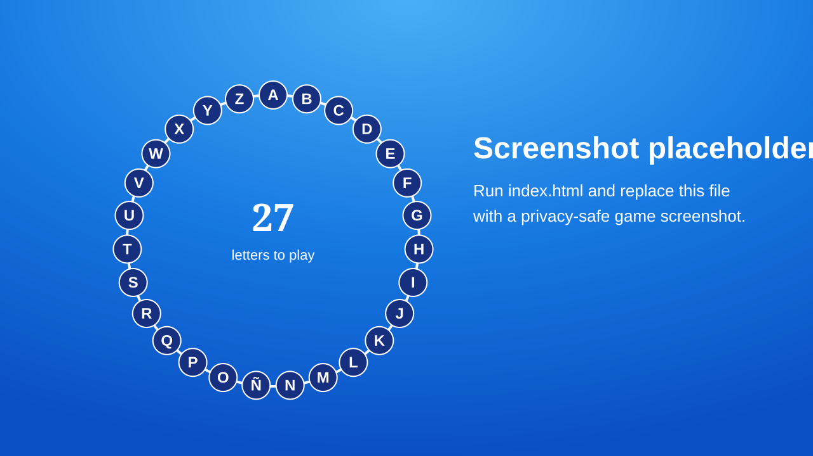

# Pasapalabra Party Game

A self-contained, offline-friendly word-ring game for parties, classrooms, team events, and family celebrations. It runs from a single HTML file: no framework, server, package manager, build step, or internet connection is required for the game itself.

The included public version contains **27 generic Spanish sample clues**. It contains no personal questions or family information.

> This is an independent party-game project inspired by circular alphabet quiz formats. It is not affiliated with or endorsed by any television programme or broadcaster.

## Features

- 27-letter ring: A-Z plus Ñ
- Correct, pass, and incorrect controls with automatic advance
- Correct and incorrect counters
- Configurable countdown timer
- Scrolling prize banner with a five-question countdown
- Spanish text-to-speech through the browser Web Speech API
- New speech immediately replaces the previous clue when another letter is selected
- Voice mute button and `V` shortcut
- Keyboard, mouse, and touch controls
- Fullscreen mode for a projector or television
- Confetti on completion, plus fireworks for a perfect round
- Responsive layout
- Works offline after the HTML file has been downloaded

## Screenshot



Replace the placeholder with a real screenshot before publishing the repository if you want a visual preview on GitHub.

## Quick start

1. Download or clone this repository.
2. Open `index.html` in a modern browser. Chrome or Edge is recommended on Windows.
3. Select a letter.
4. Mark the answer with **OK**, **PASS**, or **NOK**.
5. Use the timer controls when you are ready to begin.

No installation is required.

## Customise the questions

Open `index.html` in a text editor and find `const PREGUNTAS = [` near the beginning of the `<script>` section. Each question uses this exact structure:

```js
{ letra: "A", definicion: "Empieza por la A: ...", respuesta: "..." },
```

- `letra`: the displayed letter
- `definicion`: the clue shown on screen and read aloud
- `respuesta`: the answer shown to the host

Keep exactly 27 entries in this order:

```text
A B C D E F G H I J K L M N Ñ O P Q R S T U V W X Y Z
```

Edit only the text inside the quotation marks unless you are comfortable editing JavaScript. Keep the braces, commas, property names, and quotation marks intact. Save the file, then refresh the browser.

For detailed editing, privacy, timer, banner, voice, keyboard, and projector instructions, see [docs/USER_GUIDE.md](docs/USER_GUIDE.md).

## Configuration

Two constants sit immediately below `PREGUNTAS`:

```js
const SEGUNDOS_TEMPORIZADOR = 300;
const TEXTO_BOTE = "Prize challenge: complete all 27 letters";
```

- `SEGUNDOS_TEMPORIZADOR`: game time in seconds. Use `0` to disable the timer.
- `TEXTO_BOTE`: the banner shown while more than five questions remain.

## Requirements

- A modern browser with JavaScript enabled
- Chrome or Edge recommended for the most reliable fullscreen and speech behaviour
- A Spanish voice installed or available to the browser for Spanish text-to-speech
- Speakers if you want the voice announcer

The game itself has no external dependencies. Voice availability and quality depend on the browser and operating system. Test the exact laptop and browser you will use before the event.

## Privacy-safe workflow

`index.html` is safe to publish because it contains only generic examples. For a private event:

1. Copy `index.html` to `game.personal.html`.
2. Put private questions only in `game.personal.html`.
3. Keep `game.personal.html` on your computer.

The repository `.gitignore` excludes `game.personal.html` and other common private copies. Before every public push, still review `git status` and the staged diff. `.gitignore` cannot protect a private file that was already committed.

## Repository layout

```text
pasapalabra-party-game/
├── index.html
├── README.md
├── LICENSE
├── .gitignore
├── assets/
│   └── screenshot-placeholder.svg
└── docs/
    └── USER_GUIDE.md
```

## License

Released under the [MIT License](LICENSE).
